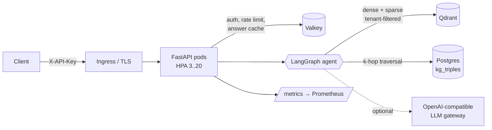
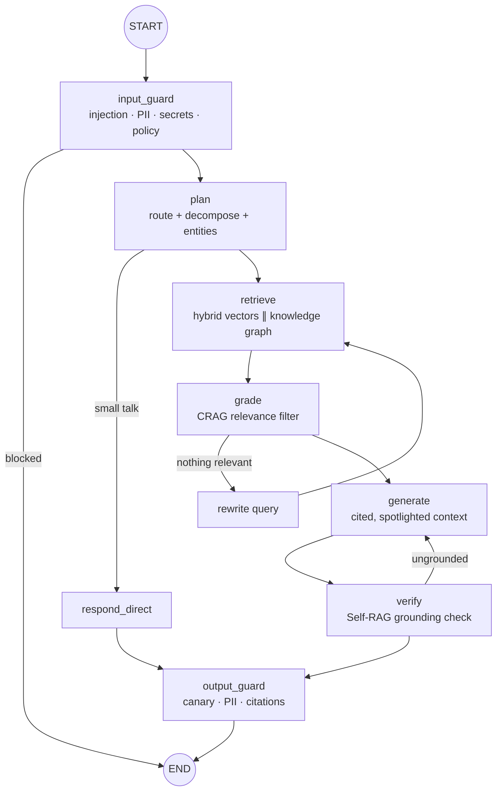

# Sentinel RAG — Agentic GraphRAG platform with AI guardrails

A production-grade **enterprise knowledge copilot**. It combines a **LangGraph** agent that corrects itself,
**hybrid RAG** (dense + sparse + RRF), a **knowledge graph** for multi-hop questions, and **guardrails on both
input and output**. It is served by an async **FastAPI** + **Pydantic v2** API and ships with **Docker**, **Kubernetes**
(Kustomize), an evaluation quality gate and CI.

> Runs **fully offline by default**: deterministic embeddings and heuristic fallbacks, so tests and CI need no API key.
> Set `LLM_PROVIDER=openai` with any OpenAI-compatible endpoint (OpenAI, Azure, vLLM, LiteLLM, an internal LLM
> gateway) to switch the same agent to a real model.

| Skill area | Where it lives |
|---|---|
| Python, FastAPI, Pydantic, asyncio | `app/main.py`, `app/api/`, `app/schemas/`; concurrent fan-out in `app/services/retrieval.py` and `ingestion.py` |
| RAG, LangChain, LangGraph | `app/agents/graph.py` (StateGraph), `app/llm/client.py` (LangChain `ChatOpenAI` + structured output) |
| Agentic workflows | plan → retrieve → grade → rewrite loop → generate → verify loop (Corrective-RAG + Self-RAG) |
| Knowledge graphs | triple extraction `app/services/extraction.py`, k-hop recursive-CTE traversal `app/infra/graphstore.py` |
| Advanced RAG | query decomposition, hybrid dense+BM25, RRF, rerank, per-doc diversity, contextual chunk headers, citations |
| AI security safeguards | `app/guardrails/`: direct + indirect prompt injection, PII/secret redaction, canary leak detection, citation validation, tenant isolation |
| Production | Docker (non-root, read-only), K8s (HPA, PDB, NetworkPolicy, PSA restricted, ExternalSecrets), Prometheus, JSON logs, CI with Trivy |

---

## Architecture



### Agent graph (LangGraph)



Every capability (planner, grader, rewriter, generator, verifier, triple extractor) **uses the LLM when one is
configured and falls back to a deterministic heuristic if the call fails**. An LLM outage lowers answer quality but
does not take the service down, and the `SentinelLLMFailures` alert fires.

### Security model

| Threat | Control |
|---|---|
| Direct prompt injection and jailbreaks | NFKC normalization, zero-width stripping, de-obfuscation (`i.g.n.o.r.e`), base64 decoding, weighted rules with noisy-OR scoring → block before retrieval |
| Indirect injection (poisoned documents) | Every chunk is scanned at ingest; malicious chunks are **quarantined** and never indexed; context is delimited and declared untrusted in the prompt |
| System-prompt leakage | A random **canary** goes into each system prompt; if it appears in the output, the answer is blocked |
| PII and secret leakage | Redacted from input, documents and output (email, phone, SSN, Luhn-checked cards, AWS/GitHub/JWT/bearer/private keys); a secret in the input blocks the request |
| Hallucination | CRAG grading, Self-RAG verification with a retry and then abstention, invalid citations stripped, confidence score |
| Cross-tenant data access | API key → tenant; **every** vector and graph query is filtered by `tenant_id` (tested) |
| Abuse | Per-tenant distributed rate limit (Valkey) plus an edge rate limit at the ingress; strict request schemas (`extra=forbid`) |
| Credential handling | Only **SHA-256 hashes** of API keys are stored; secrets come from Vault through External Secrets in prod |

---

## Quick start

### 1. Local, zero dependencies (in-memory backends, offline models)

```bash
make install
```

```bash
make test
```

```bash
make eval
```

```bash
make demo
```

`make test` runs 40 tests. `make eval` runs the RAG quality gate. `make demo` ingests `data/sample_docs` and writes `data/sample_outputs`.

### 2. Full stack with Docker Compose (Qdrant + Postgres + Valkey)

```bash
make dev-key
```

```bash
docker compose up --build -d
```

```bash
API_KEY=<key printed by make dev-key> make demo-remote
```

`make dev-key` prints an API key once and writes only its hash (plus a random DB password) to `.env`.

### 3. Kubernetes on your laptop (docker-desktop / kind / minikube), one command

```bash
make k8s-up
```

This builds the image, creates random dev secrets (git-ignored), deploys API + Qdrant + Postgres + Valkey, and
waits until every pod is healthy. It refuses to run against a non-local kubectl context.

```bash
make k8s-forward
```

```bash
API_KEY=<your key> make demo-remote
```

`make k8s-forward` exposes the API on http://localhost:8000. Other targets: `make k8s-status`, `make k8s-logs`, and `make k8s-down` (deletes everything).

The production overlay (`k8s/overlays/prod`) adds External Secrets (Vault), a real LLM and embeddings, a
ServiceMonitor with alert rules, a larger Qdrant, managed Postgres/Valkey through DSNs, and digest-pinned images.

---

## API

| Method | Path | Purpose |
|---|---|---|
| `POST` | `/v1/ingest` | Ingest JSON documents (idempotent per `doc_id`) |
| `POST` | `/v1/ingest/file` | Upload `.md` / `.txt` / `.pdf` (size and type limited) |
| `DELETE` | `/v1/documents/{doc_id}` | Remove a document's vectors and graph triples |
| `POST` | `/v1/query` | Ask a question → answer, citations, graph facts, guardrail report, trace |
| `POST` | `/v1/query/stream` | Same, as Server-Sent Events (one `step` event per agent node, then `result`) |
| `GET` | `/v1/graph/entities/{name}?hops=2` | Explore the knowledge graph around an entity |
| `GET` | `/healthz` · `/readyz` · `/metrics` | Liveness, readiness (checks dependencies), Prometheus |

### Input → output example

**Input** ([`data/sample_requests/queries.json`](data/sample_requests/queries.json)):

```json
{ "question": "Which team owns the Fraud Engine and what does the Payments API depend on?" }
```

**Output** ([`data/sample_outputs/02_multi_hop_graph.json`](data/sample_outputs/02_multi_hop_graph.json), abridged):

```json
{
  "answer": "The Payments API depends on Ledger Service and Fraud Engine. [1] Fraud Engine is owned by Team Sentinel and integrates with Stripe Radar for real-time risk scoring. [1] ...",
  "citations": [{ "ref": 1, "doc_id": "payments-platform-architecture", "section": "Dependencies", "score": 1.0, "snippet": "..." }],
  "graph_facts": [
    { "subject": "Fraud Engine", "predicate": "owned by", "object": "Team Sentinel" },
    { "subject": "Payments API", "predicate": "depends on", "object": "Ledger Service" }
  ],
  "confidence": 0.971,
  "grounded": true,
  "guardrails": { "blocked": false, "pii_redacted": [], "injection_score": 0.0 },
  "plan": { "route": "retrieve", "sub_queries": ["...", "Which team owns the Fraud Engine", "does the Payments API depend on"],
            "entities": ["fraud engine", "payments api"] },
  "trace": [{ "node": "input_guard", "ms": 0.11 }, { "node": "plan", "ms": 0.04 }, { "node": "retrieve", "ms": 5.1 }, "..."]
}
```

[`data/sample_outputs/`](data/sample_outputs) has the real responses for all 12 scenarios:

| Scenario | Result |
|---|---|
| Factual, policy, process | Cited answer, confidence about 0.9 |
| Multi-hop | Vector context plus knowledge-graph facts |
| Out of scope | Abstains with confidence 0 |
| Direct and obfuscated injection | Blocked at `input_guard`; no retrieval happens |
| PII in the question | Redacted before it reaches the LLM, logs or cache |
| AWS key in the question | Blocked and the user is told to rotate it |
| Poisoned vendor doc | Malicious chunk quarantined at ingest (`00_ingest_response.json`) and never surfaces |

---

## Evaluation quality gate

`scripts/evaluate.py` runs [`eval/golden.jsonl`](eval/golden.jsonl) and fails CI if any metric drops below its
threshold:

| Metric | Threshold | Current (offline mode) |
|---|---|---|
| Retrieval hit-rate / MRR | 0.85 / 0.70 | 1.00 / 1.00 |
| Answer accuracy (required facts present) | 0.80 | 1.00 |
| Groundedness | 0.90 | 1.00 |
| Abstention on out-of-scope | 1.00 | 1.00 |
| Injection block recall / precision | 1.00 / 1.00 | 1.00 / 1.00 |

The golden set is small and synthetic (23 cases). Grow it from real user traffic, and add LLM-as-judge metrics
(e.g. RAGAS faithfulness) when you run in `openai` mode.

---

## Project layout

```
app/
  main.py               app factory, middleware (request-id, metrics, security headers), error handling
  container.py          composition root (DI), startup/shutdown, health
  core/                 config (pydantic-settings), JSON logging, Prometheus metrics
  api/                  auth + rate-limit deps, v1 routes, health routes
  schemas/              API contracts + domain models + structured LLM output schemas
  agents/               LangGraph graph, capabilities (LLM + fallback), AgentService (cache, SSE)
  services/             chunking, ingestion pipeline, hybrid retrieval, KG extraction, text utils
  infra/                Qdrant / in-memory vector store, Postgres / in-memory graph, Valkey cache, embedders
  guardrails/           injection detector, PII/secret redaction, input/output policy
  llm/                  LangChain client wrapper, prompts (spotlighting, canary)
data/                   sample_docs (input), sample_requests, sample_outputs
eval/                   golden set; scripts/evaluate.py = quality gate
k8s/                    base, datastores, overlays/{dev,prod}
tests/                  40 unit + API tests (auth, isolation, guardrails, KG, streaming, rate limit)
```

## Design decisions and trade-offs

- **Postgres for the knowledge graph instead of a graph DB.** A recursive CTE handles 2–3 hop traversals well,
  with one fewer system to run, and the license is permissive. Move to a dedicated graph engine if you need deep
  path queries.
- **Qdrant named dense + sparse vectors**, with an IDF modifier on the server and tenant-partitioned HNSW
  (`is_tenant`). Hybrid retrieval beats either signal alone on acronyms and IDs.
- **RRF over score blending.** It is scale-free across retrievers. The rerank step can be swapped for a
  cross-encoder behind the same function.
- **Heuristic fallbacks for every LLM step.** They give hermetic CI and graceful degradation, at the cost of
  lower quality when no model is available.
- **Liveness never checks dependencies; readiness does.** A database blip should not trigger restart storms.
- **Fail-open rate limiting** if Valkey is down, because availability matters more than strict limits here.
  Flip it for abuse-sensitive deployments.

## Roadmap ideas

Cross-encoder reranker · conversation memory with LangGraph checkpointer · async ingestion queue (SQS/Kafka) for
large corpora · document-level ACLs · OpenTelemetry tracing · ML-based injection classifier ensembled with the
rule engine · Helm chart.

## Licenses

All dependencies and images use permissive licenses: FastAPI, Pydantic, LangChain, LangGraph, structlog, redis-py
(MIT); qdrant-client, Qdrant, asyncpg, prometheus-client (Apache-2.0); httpx, uvicorn, pypdf, Valkey (BSD);
PostgreSQL (PostgreSQL License).
